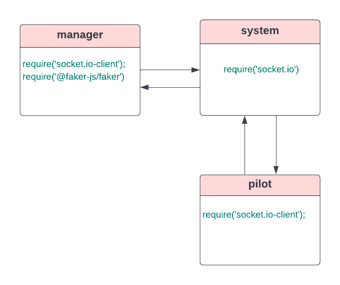

# airline-system
use socket.io instead of Node Events to handle  connections between multiple system components, which in turn facilitate real-time communication and allow bi-directional communication between client and server.
create message queue to store the events when the pilot is offline and send them back when he became online.

**system.js file**

Add new object called 'queue' that have One property (flights) to contain all 'new-flight' events.

**pilot.js file**

trigger 'get-all' event, to get all messages back from the message queue.

After triggering the 'flight-arrived' event make sure to delete the flight from the message queue.

Listen to 'fligt' event to log this message to the console 'Pilot:Sorry i didn't catch this flight ID 332u443673r32yuf463

## UML Diagram

